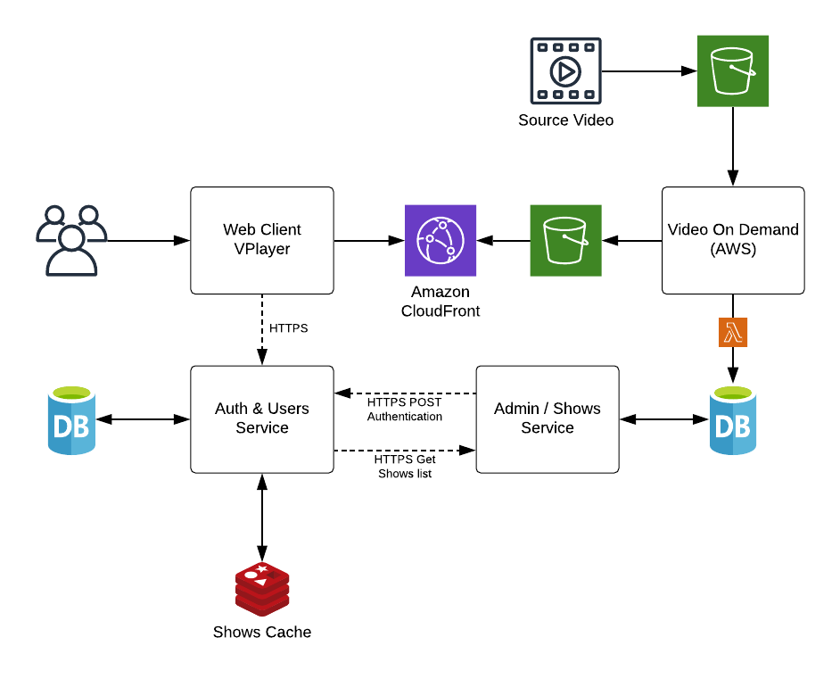

# Shows on Demand Prove of Concept

## Overview
Shows on Demand is a SaaS product that serves video shows on demand by using a Web client that provides user access to available shows. By using the Web Client user can register into the service and what a series of available shows on demand.

The service is composed of various services that are described below. These services have been developed in Python3 using Flask and Postgres as the storage engine at the moment of this writing but the technology is also dependent on the Could Platform selected. Notice that at the moment only the backend services are the one existing the POC but the service is composed for various backend and web client services which are described below. All backend service exposes a REST API to interact with the functionality and resources that they expose.

The Shows on Demand relies heavily on an architecture similar to "Video on Demand on AWS" [1] in order to convert into stream ready video shows and make the videos available for on-demand consumption. Despite, not being a key feature for the POC in the document are few parts that cover the idea of using a "Video On Demand architecture".

### High-Level Architecture Diagram

## Storage
Different persistent technologies are used by the architecture. There is a need for technologies with the capability of Data durability, high reliability, scalability with controlled access of the data. For the purpose of this POC S3 was used as the technology that provides these features and because it is also the one required by the Video on Demand architecture we have selected to produce the streaming videos. However, similar technology can be found in Azure and GCP.

Similar to file storage or deep storage technologies happens with technologies used to store business model. For the sage of this POC Postgres was selected as the technology to archive this but different technologies can be easily implemented for production environments and based on different Cloud Provider Platform as is the case of AWS and Azure.

 

Redis Cache is used to cache the latest available shows for a period of 1h. The idea of using Redis Cache is behind the scope of the POC and not a requirement at the moment as all users get the same available shows the result can be in-memory cached until a more complex business logic is introduced to distribute recommended content for instance.

## Security
All services are deployed on VPN and all HTTP requests are encrypted with SSL/TLS meaning that all our calls are executed with HTTPs. In addition, by using ECS we are enabling a highly secure and reliable service.

## List of Services
<table>
  <tr>
   <td>Service Name
   </td>
   <td>Description
   </td>
   <td>Repository
   </td>
  </tr>
  <tr>
   <td>shows-on-demand-admin
   </td>
   <td>Admin service is in charge of adding, updating and deleting Shows. In order to support the update by the Admin Web client, the Admin module has also a table to control the admin’s authentication independently.
   </td>
   <td> 
   </td>
  </tr>
  <tr>
   <td>shows-on-demand-users
   </td>
   <td>User service is in charge of the users’ registration and authentication.
   </td>
   <td> 
   </td>
  </tr>
  <tr>
   <td>shows-on-demand-users-web
   </td>
   <td>The User Web client is a web application that user can use to register and get authenticated respectively in order to play shows from the available list of shows.
   </td>
   <td> 
   </td>
  </tr>
  <tr>
   <td>Shows-on-demand-admin-web
   </td>
   <td>The Admin Web client is a web application used by the administrator to add, update and delete Shows in a more user-friendly way using a UI.
   </td>
   <td> 
   </td>
  </tr>
  <tr>
   <td>Shows-on-demand-aws
   </td>
   <td>Video on Demand on AWS
   </td>
   <td> 
   </td>
  </tr>
</table>

### Admin service
The Admin service is in charge of managing the Shows. It adds, updates and deletes shows. The service also includes an Admin web client that is used to provide a UI to manage Shows in order to update their properties and decide whether or not a show becomes available.

#### REST API
The service provides an API to expose its functionality to other services.

<table>
  <tr>
   <td>Method
   </td>
   <td>Service Endpoint
   </td>
   <td>Description
   </td>
  </tr>
  <tr>
   <td>GET
   </td>
   <td>/shows
   </td>
   <td>Retrieve the list of shows
   </td>
  </tr>
  <tr>
   <td>POST
   </td>
   <td>/shows
   </td>
   <td>Create a new show resource based on the request body payload
   </td>
  </tr>
  <tr>
   <td>PUT
   </td>
   <td>/shows/{showId}
   </td>
   <td>Update the show with Id equal to showId with the data specified in the request body payload
   </td>
  </tr>
  <tr>
   <td>DELETE
   </td>
   <td>/shows/{showId}
   </td>
   <td>Delete the show with Id equal to showId
   </td>
  </tr>
  <tr>
   <td>GET
   </td>
   <td>/api-docs
   </td>
   <td>API documentation
   </td>
  </tr>
</table>

#### Storage
This service contains two tables. One to register shows and one to register admin users. The users’ table is not that necessary but it would keep more secure in order to manage shows.

As all the infrastructure runs under a VPN the show’s availability through a REST API is not restricted as the purpose of the API is to manage shows as a resource and provide the list of available shows.

#### Models
Shows (Id, title, description, dashSrcVideoURL, hlsSrcVideoURL, created_at)

#### Dependencies
This service only depends on the Storage technology in this case Postgres.

### Users service
The Users client has a REST API to manage all the users’ functionality including the registration and authentication. The Users service depends on the Admin service. In other words, the admin service is an external service used by the Users service.

#### REST API

<table>
  <tr>
   <td>Method
   </td>
   <td>Service Endpoint
   </td>
   <td>Description
   </td>
  </tr>
  <tr>
   <td>GET
   </td>
   <td>/users
   </td>
   <td>Retrieve the list of shows
   </td>
  </tr>
  <tr>
   <td>POST
   </td>
   <td>/users
   </td>
   <td>Add a new user based on the request body payload
   </td>
  </tr>
  <tr>
   <td>PUT
   </td>
   <td>/users/{userId}
   </td>
   <td>Update the user with Id equal to userId with the data specified in the request body payload
   </td>
  </tr>
  <tr>
   <td>DELETE
   </td>
   <td>/users/{userId}
   </td>
   <td>Delete the user with Id equal to showId
   </td>
  </tr>
  <tr>
   <td>POST
   </td>
   <td>/auth/register
   </td>
   <td>Register/Add a new user based on the request body payload. The difference between the users’ endpoint is on the response. The Register process includes the authorization token.
   </td>
  </tr>
  <tr>
   <td>POST
   </td>
   <td>/auth/login
   </td>
   <td>Execute the login process based on the request payload.
   </td>
  </tr>
  <tr>
   <td>GET
   </td>
   <td>/auth/logout
   </td>
   <td>Execute the user logout operation
   </td>
  </tr>
</table>

#### Models
Users (id, username, email, password, active, admin, created_at)

#### Dependencies
The Users service does not depend on any external service. 

A good recommendation could be to split the Auth service and the Users into two microservices. As a result of that split, the Users service will become dependent on the Auth service and also would be a dependency for the Admin service.

### Users Web client service
The Web Client that is used by customers to register, authenticate, list shows, watch shows and logout. This service is not covered in the POC. Preferable technology to implement the clients are Angular and React.

After the user gets authenticated at the login section, he/she is redirected to a landing page where the list of Shows is rendered. The list is retrieved from the Admin/Shows service that acts as an external service in the Users/Auth.

#### Authentication
JSON Web Token (JWT) is the mechanism used for authentication of the user to the Web Client

### Admin Web client service
The Web Client that is used by customers to register, authenticate, list shows, watch shows and logout. This service is not covered in the POC. Preferable technology to implement the clients are Angular and React.

#### Authentication
JSON Web Token (JWT) is the mechanism used for authentication of the user to the Web Client

### Video On Demand on AWS
Architecture as the one provided by AWS in Video On Demand is used to produce URLs about the shows that are consumed by the Web Client.

The output of the workflow of uploading the original video to an S3 location ends with the URLs of the available version of the video on demand to be used by the video player. At that moment when the last state of the Publish AWS Step Functions [2] is reached a Lambda function [3] that creates a new Show item in the shows table. A new Show item is created with the following properties:

*   hlsSrcVideoURL=https://dxxxxxxx.cloudfront.net/output/hls/testvid.m3u8, where the assets are located in /output/hls/testvid/ for the HLS version.
*   dashSrcVideoURL=https://dxxxxxxx .cloudfront.net/output/dash/testvid.mpd, where the assets are located in /output/dash/testvid/ for the DASH version.

Note that other properties are also involved in the creation of the shown item but they are covering in the model section. Also, notice that a property called "state" mark the real availability of the show once it is validated for a human agent or an ML video content analyser agent.

#### Consideration about using an AWS technology for notification
The shows ready for review notification is independent of the Cloud provider selected. If there is a disconnection provided by the selection of different technologies notification such as SMS, Email about the stream show ready for review or addition using the Admin client can be used instead.

#### Show Stream Tester
In order to test any of the produced URLs by the Video on Demand on AWS workflow, The JW Player Stream Tester [4] can be used for this purpose.

## CI/CD
The continuous integration and deployment are being executed by using Travis as a POC. The recommendation for more robust automation of integration and continuous delivery is to use Jenkins.

The service is prepared to be deployed in AWS using Amazon Elastic Container Service.

## Alerting and Logging
Alerting and Logging are topics that are not covered in the POC. However, logging is used around the code and it is properly configured. The recommendation technology for Alerting from metric is NewRelic [5] and SumoLogic [6] as the centralized logging platform.

## Future Considerations
The technology stack used by the POC is independent of the tech stack that can be used to implement this service architecture. Solutions as AWS and Azure can implement the deployment of each service slightly different.

 

It would be interesting to centralize admin access through the Users service. At the moment the Admin service also contains a users table to control this access with a reduced number of administrators. However, we could make the Admin service dependant on the User service in term of user authentication.

Extraction the Auth service from the Users service might be another good solution so both the Users and Admin service respectively would be dependant service of the Auth service in charge of providing credentials to users of both services using a centralized service for this purpose. 

The current design requires a route from the Users service to invoke the Admin as an external service to retrieve the list of shows. In addition, the authorization control to retrieve the list of shows in the Admin service need to be implemented creating a dependency in the Admin service by using remote functionality from the Auth service which is currently in the Users service.

All usage of external service should be backed up by a Circuit Breaker pattern in order to guarantee the fail-fast to recover fast.

In addition to external services. All services that request data from external service should implement a cache solution to reduce latency and therefore the quality of the service.

Contracts, should be well-designed, uniform and ensuring they are following the REST API design best practices.

Models are not totally developed as they are highly based on business need. Therefore, this is another issue to consider.

At the repositories, code has to be well documented and all business code should be unit tested and integration between service should also be tested. In addition to testing an e2e test should be included in the main service. However, it is always good as well to include e2e test per service to test the service in insulation.

## References
[1][ https://aws.amazon.com/solutions/video-on-demand-on-aws/](https://aws.amazon.com/solutions/video-on-demand-on-aws/)

[2][ https://aws.amazon.com/step-functions/](https://aws.amazon.com/step-functions/)

[3][ https://aws.amazon.com/lambda/](https://aws.amazon.com/lambda/)

[4][ https://developer.jwplayer.com/tools/stream-tester/](https://developer.jwplayer.com/tools/stream-tester/)

[5] [https://newrelic.com/](https://newrelic.com/)

[6] [https://www.sumologic.com/](https://www.sumologic.com/)
